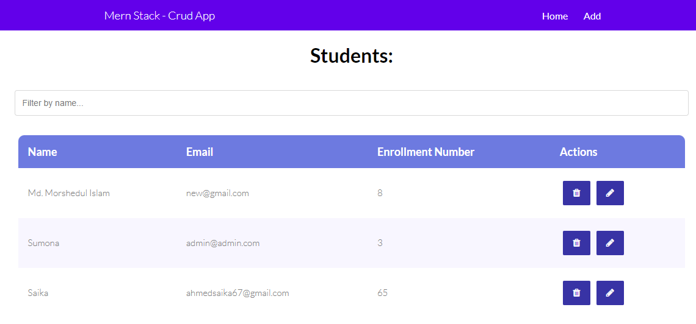
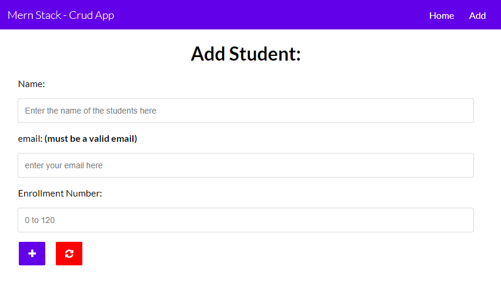
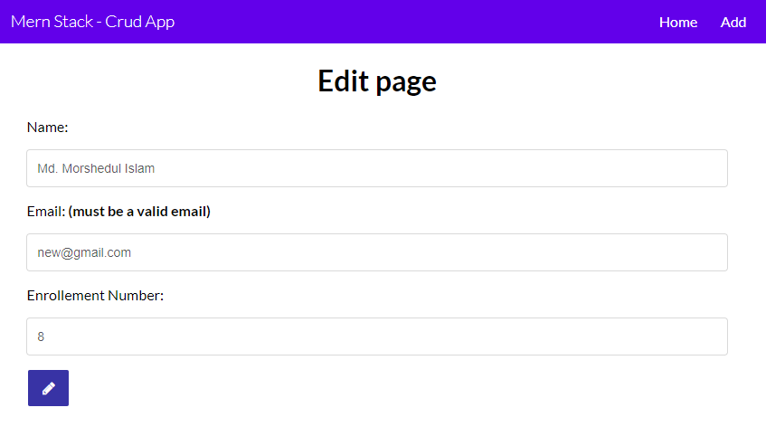

# Mern-Stack-Crud-App

This is a simple crud project built with the following technologi es:
- React
- Node, Express, Mongodb


## Feature
- Add, Update, Delete Student information
- Serch students using name

## Screenshot





## Usage

- Backend
```shell
node server.js
```

- Frontend
```shell
cd client && npm start
```
